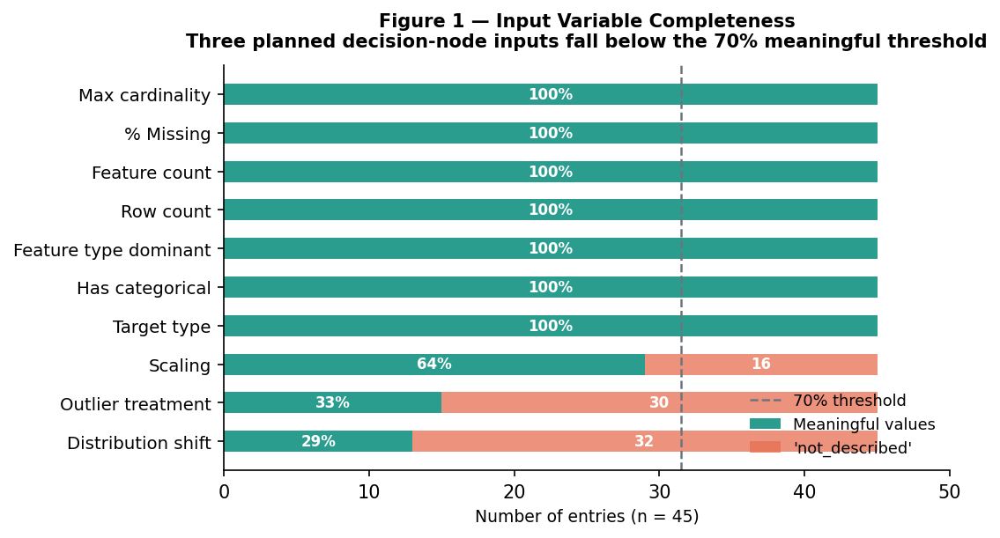
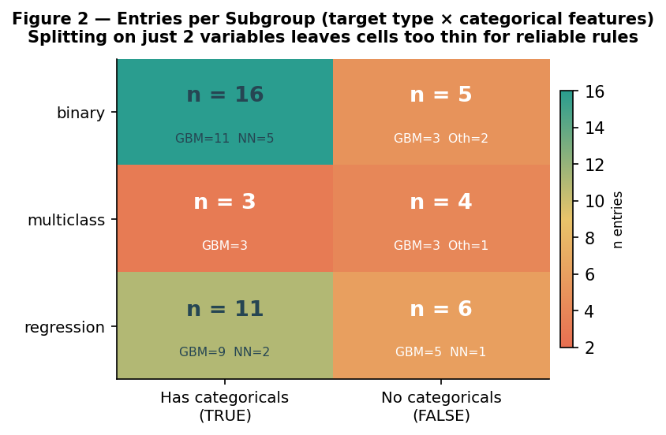
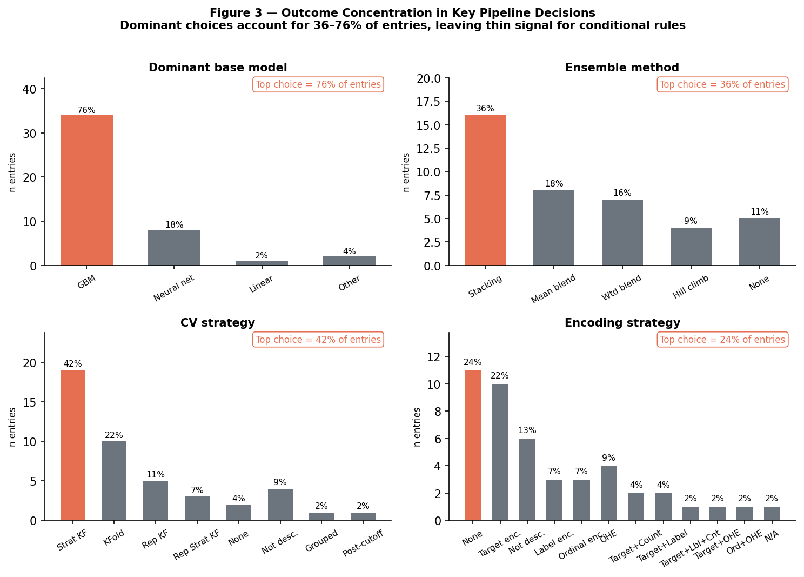

# Phase 4 Blockers Report — Decision Flowchart Construction
**CS495 Capstone | Kenneth Young | May 17, 2026**

---

## Overview

This report documents dataset limitations discovered during pre-Phase 4 analysis that constrain the scope and statistical grounding of the planned decision flowchart. The purpose is to align with Prof. Albuquerque on adjusted scope before flowchart construction begins (scheduled May 19–25).

---

## Background

Phase 3 produced a 45-entry dataset (`data/kaggle_meta_analysis.xlsx`, 36 columns) covering top-finishing Kaggle tabular competition solutions. Phase 4 is intended to synthesize that dataset into a decision flowchart mapping dataset characteristics to pipeline decisions.

Pre-construction analysis reveals that several planned flowchart branches are unsupported by the data as collected.

---

## Blocker 1: Key Input Variables Are Unreliable as Decision Nodes

The flowchart was designed to branch on dataset characteristics (inputs) to recommend pipeline decisions (outputs). Two distinct problems affect candidate input variables — genuine data sparsity and structural omission — and they require different treatment.

### 1a. Genuinely Sparse Fields (Writeup Culture Gap)

| Variable | Known Values | Not Described | Usability |
|---|---|---|---|
| `distribution_shift` | 13 / 45 (29%) | 32 / 45 (71%) | **Unusable** |
| `outlier_treatment` | 15 / 45 (33%) | 30 / 45 (67%) | **Unusable** |

These fields were coded as `not_described` when the solution writeup did not mention the topic. The high rates reflect a gap in Kaggle writeup culture: authors focus on novel techniques and omit decisions that felt routine. This is a genuine documentation gap — we simply do not know whether distribution shift existed or outlier treatment was applied for the majority of entries.

**Impact:** Both must be dropped as flowchart input nodes. Cannot branch on information we don't have.

### 1b. Structurally Omitted Fields (Not a Data Gap)

| Variable | Known Values | Not Described | Dominant Known Answer | Usability |
|---|---|---|---|---|
| `scaling` | 29 / 45 (64%) | 16 / 45 (36%) | `none` (15/29 = 52%) | **Marginal** |
| `missing_data_strategy` | 42 / 45 (93%) | 3 / 45 (7%) | `none/not_applicable` (35/42 = 83%) | **Not a blocker** |

These fields tell a different story. `missing_data_strategy` is 93% known — 35 of 45 winners explicitly did not impute, which is itself an empirical finding (80% of Playground Series data is synthetically generated without missing values). `scaling` is 64% known, with the majority of known entries saying `none`. The remaining 36% not_described for scaling is a real gap, but the structural signal is clear: GBM-based solutions almost never scale features because tree models are scale-invariant.

**Note:** An earlier version of the EDA completeness audit incorrectly reported `missing_data_strategy` at 13% and `scaling` at 27% because the analysis helper treated `none` as equivalent to `not_described`. This has been corrected in the notebook (re-executed May 17, 2026) and in the research report (Sections 3.7 and 4.2).

**Impact:** `scaling` is excluded from flowchart nodes because 36% remains genuinely unknown. `missing_data_strategy` is not a blocker — the flowchart can include an unconditional recommendation ("do not impute by default; let the GBM handle missing values natively") backed by 93% field coverage.

---

## Blocker 2: Sample Size Is Too Small for Multi-Variable Conditioning

With n = 45, splitting by the three primary input variables (target type × has_categorical × dataset size tier) produces subgroup sizes of approximately 5–8 entries per cell. This is insufficient for reliable conditional recommendations.

Example cross-tab (target type × dominant base model):

| Task Type | n | GBM | Neural Network | Other |
|---|---|---|---|---|
| Binary | 21 | 14 (67%) | 5 (24%) | 2 (10%) |
| Regression | 17 | 14 (82%) | 3 (18%) | 0 |
| Multiclass | 7 | 6 (86%) | 0 | 1 (14%) |

The subgroup sizes (n = 7–21) are too small to test conditional effects. A 3-variable split would yield cells of n ≈ 3–5, well below the threshold for any meaningful inference.

**Impact:** The flowchart cannot include deeply nested conditional branches. It must remain shallow (1–2 variables conditioning any given recommendation).

---

## Blocker 3: Dominant Patterns Leave Little Conditional Signal

The most important finding from Phase 3 is also the main structural challenge for Phase 4: the outcomes are heavily concentrated.

| Decision | Dominant Choice | Prevalence |
|---|---|---|
| Model family | GBM (LightGBM / XGBoost / CatBoost) | 34 / 45 (76%) |
| Approach | Ensemble | 40 / 45 (89%) |
| Ensemble method | Stacking or blend | 37 / 40 (93% of ensembles) |
| CV strategy | Stratified k-fold or k-fold | 29 / 41 documented (71%) |
| Missing data | No explicit treatment | 35 / 45 (78%) |

When a single choice accounts for 76–89% of cases, there is limited variation for the remaining choices to be conditional *on*. The flowchart risks collapsing to: "Use a GBM ensemble; almost always." That is an accurate finding, but not a rich decision tree.

---

## What the Data Does Support

Despite the above constraints, the data supports the following flowchart branches with defensible evidence:

**1. Task type → CV strategy** *(statistically supported, Fisher's exact p = 0.03)*
- Binary / multiclass classification → stratified k-fold
- Regression → standard k-fold

**2. Categorical features present → encoding approach** *(descriptive, n adequate)*
- No categorical features → no encoding needed
- Categorical features present → target encoding (default); one-hot only for low cardinality (< ~10 levels)

**3. Model selection default** *(descriptive, overwhelming consensus)*
- Default: GBM ensemble (LightGBM / XGBoost / CatBoost blend or stack)
- Consider NN: binary task + categorical features present (23% of that subgroup used NN as dominant base model vs. 7% without categorical features)

**4. Missing data handling** *(empirically grounded — 93% field coverage)*
- 35/45 winners explicitly applied no imputation. 80% of Playground Series data has no missing values by design. Recommendation: do not impute by default; GBMs handle missing values natively. This is not a gap — it is the finding.

---

## Proposed Scope Adjustment

| Original Plan | Adjusted Scope |
|---|---|
| Multi-level decision tree with 6–8 input variables | Shallow flowchart with 3–4 primary decision nodes |
| Statistical validation of each branch | One statistically supported branch (CV strategy); remainder framed as empirically observed practice |
| distribution_shift and outlier_treatment as input nodes | Dropped; replaced with unconditional notes |
| Nested conditioning (target type × categorical × size) | Single-variable conditioning only |

The adjusted flowchart remains empirically grounded and honest — it reflects what the data actually shows rather than what was originally hoped. The Discussion section will address these limitations explicitly.

---

## Questions for Prof. Albuquerque

1. Is a 3–4 node flowchart acceptable given the n = 45 constraint, or is there an expectation of greater depth?
2. Should the flowchart distinguish between "statistically supported" and "descriptive/normative" branches visually (e.g., with different node styling)?
3. Is the retrospective validation in Phase 5 still expected to validate the full flowchart, or should it focus on the statistically supported branches only?

---

*Report generated May 17, 2026. Updated May 17, 2026 (Blocker 1 revised to distinguish genuine sparsity from structural omission; EDA completeness audit corrected). Dataset: `data/kaggle_meta_analysis.xlsx` (45 entries, 36 columns). Analysis code available in `notebooks/01_eda.ipynb`.*
