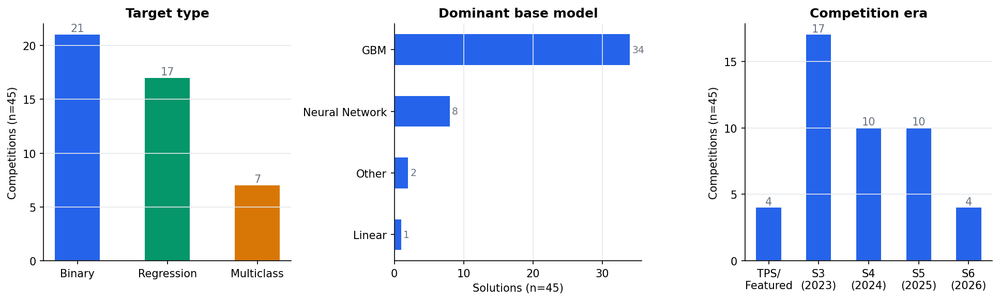
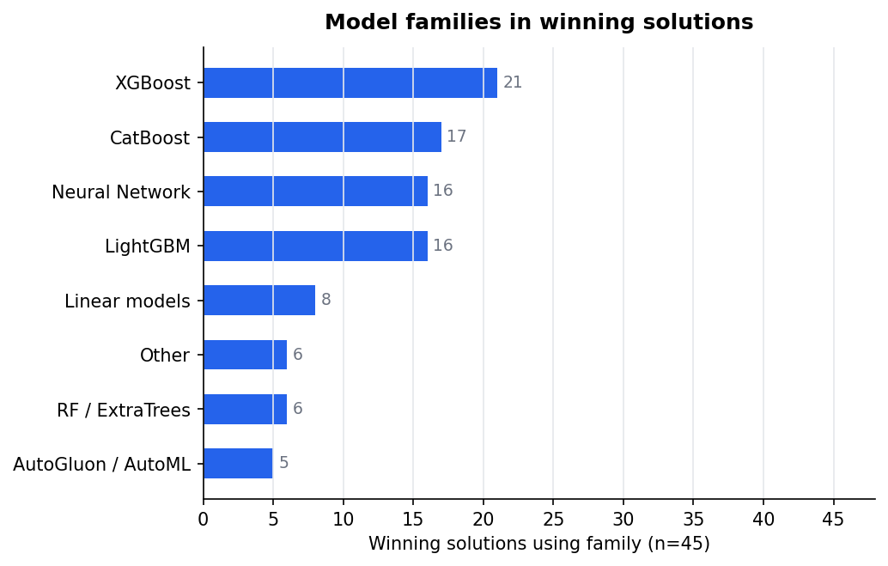
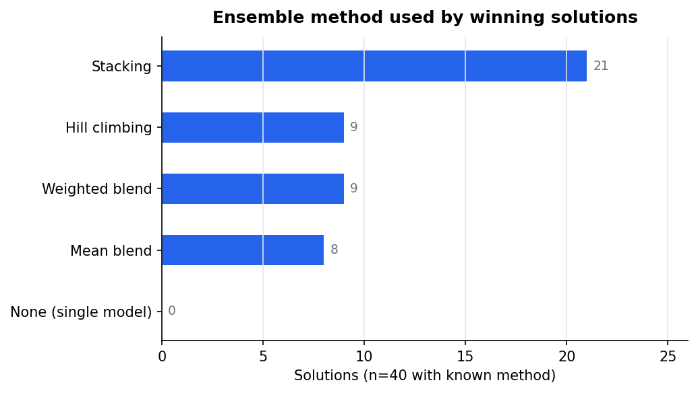
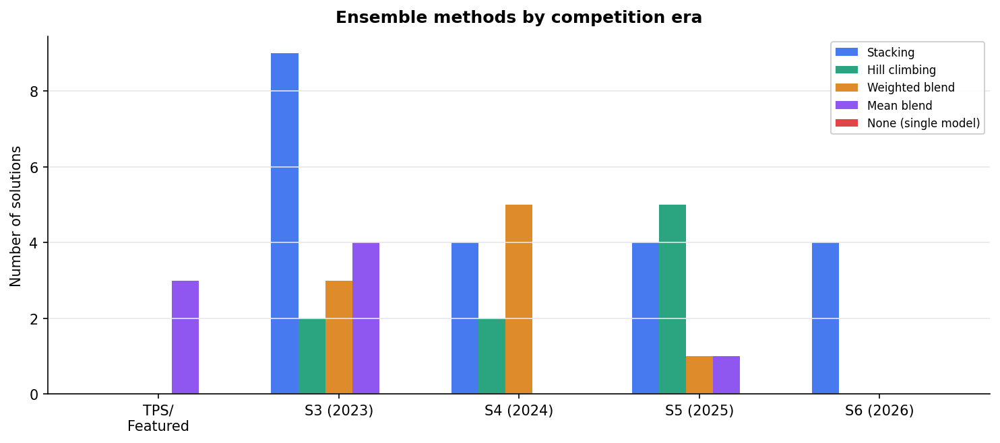
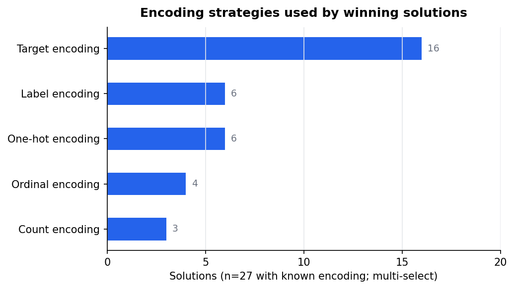
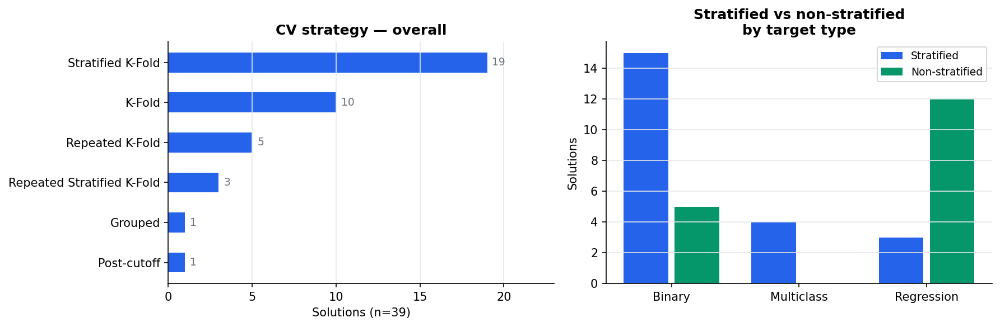
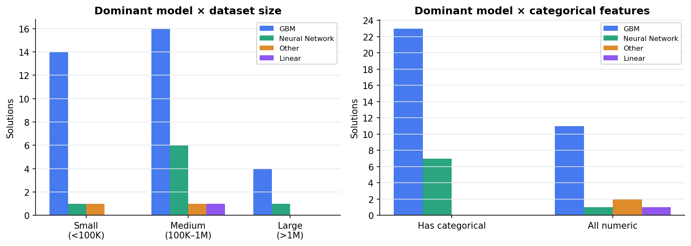

# EDA Visual Summary
**CS495 Capstone — Mapping Best Empirical Models**
Kenneth Young | May 18, 2026

Dataset: 45 Kaggle tabular competitions (Playground Series S3–S6 + Featured, 2022–2026)

---

## 1. Dataset Overview

Distribution of entries by target type (binary, regression, multiclass), dominant model family, and competition era. GBMs account for 76% of winning solutions; the dataset spans four years with no single era dominating.

---

## 2. Model Family Usage

Frequency of model families across all 45 entries. GBM (LightGBM, XGBoost, CatBoost) is the dominant family. Neural networks appear in 18% of entries, concentrated in categorical-heavy datasets.

---

## 3. Ensemble Methods — Overall

89% of winning solutions use some form of ensembling. Stacking (OOF-based meta-learner) is the most common method, followed by weighted blending. Single-model wins are the exception.

---

## 4. Ensemble Methods — By Era

Ensemble strategy has shifted over time. S3 solutions favored manual blending; S4–S5 saw the rise of AutoGluon-style automated stacking; S6 features large KGMON-style mega-stacks with 100+ base models.

---

## 5. Encoding Strategy

Among the 39 entries with documented encoding strategy, target encoding is the most frequent choice (16/39). One-hot encoding is used primarily for low-cardinality categorical features. 6 entries required no encoding (all-numeric datasets).

---

## 6. CV Strategy

CV strategy splits clearly by task type. Classification entries favor stratified k-fold (67%); regression entries favor plain k-fold (47%). This is the only statistically significant finding in the dataset (Fisher's exact p = 0.03).

---

## 7. Model Selection

GBM dominance holds across dataset sizes and feature types. Neural networks are more prevalent in datasets with categorical features (23% of categorical entries vs. 7% of numeric-only entries), suggesting a conditional model selection signal.

---

## Key Takeaways

| Finding | n | Note |
|---|---|---|
| GBM is the dominant model family | 34/45 (76%) | Consistent across eras and target types |
| Ensembling is near-universal | 40/45 (89%) | Stacking most common method |
| Target encoding dominates encoding choices | 16/39 documented | Among entries with categorical features |
| CV strategy tracks task type | Fisher p = 0.03 | Only statistically significant result |
| Neural networks favor categorical datasets | 23% vs 7% | Descriptive only; n too small for inference |

---

## Limitations

- `scaling` (64% filled) and `distribution_shift` (29% filled) are too sparse to use as flowchart decision nodes. GBM authors rarely document scaling because tree-based models don't require it.
- GBM dominance (76%) leaves insufficient variance to condition on for multi-variable analysis — subgroup cells are 3–16 entries.
- The 4 S6 entries are methodologically distinct (KGMON mega-stacks, LLM-assisted coding) and may not generalize to typical competition workflows.
